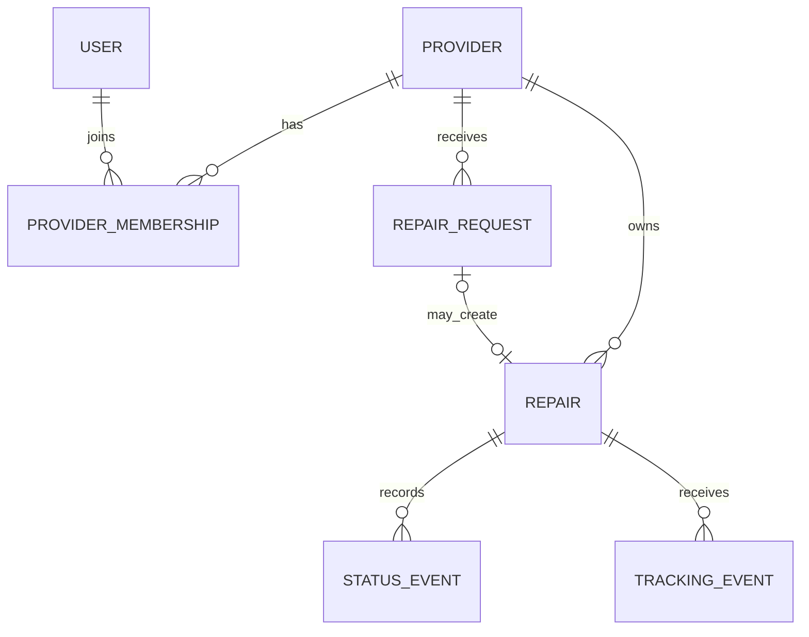

# 08 — Domain Model

## Core relationships



## Provider

Represents the repair business identity rather than a login identity.

Key domain properties:

- type: Shop or Independent
- display identity
- Service Area
- supported Service Modes

## User / Provider Membership

`User` is an authenticated human.

Membership answers:

> Which Provider may this User act for?

For MVP, the role model may remain minimal while preserving the separation.

## RepairRequest

Represents customer-submitted pre-acceptance information.

Important invariants:

- belongs to exactly one Provider;
- may create at most one Repair;
- is not an active Repair;
- customer information is reported, not automatically authoritative;
- accepted data may be corrected during Repair creation.

## Repair

Central accepted-work entity.

Important invariants:

- belongs to exactly one Provider;
- has one origin: Request or direct Provider creation;
- receives initial `IN_PROGRESS` automatically;
- has one current Repair Status;
- changes in Repair Status create Status Events;
- public tracking must not expose private fields.

## Device Snapshot

Value-like information owned by one Repair rather than a permanent global Device record.

This avoids prematurely turning Tracknologia into:

- device inventory;
- customer-device CRM;
- serial-number registry.

## StatusEvent

Append-oriented history of meaningful Repair Status transitions.

The Repair may cache/store current status for efficient reads, but Status Events retain the timeline required for validation and history.

## Service Mode

Provider-level supported modes and Repair/Request-level chosen mode must be distinguished:

```text
Provider.supported_service_modes = {MEETUP, HOME_SERVICE, DROP_OFF}
Repair.selected_service_mode = MEETUP
```

## Reported Problem vs Diagnosis

`ReportedProblem` describes the Customer's symptoms/claim.

`Diagnosis` contains the Provider's technical assessment.

They must remain separate throughout the model.
